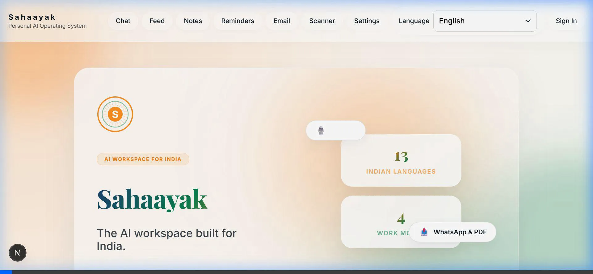
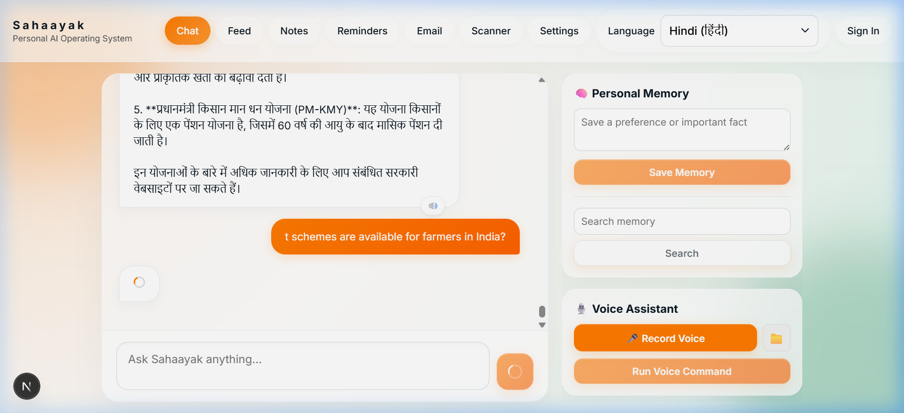
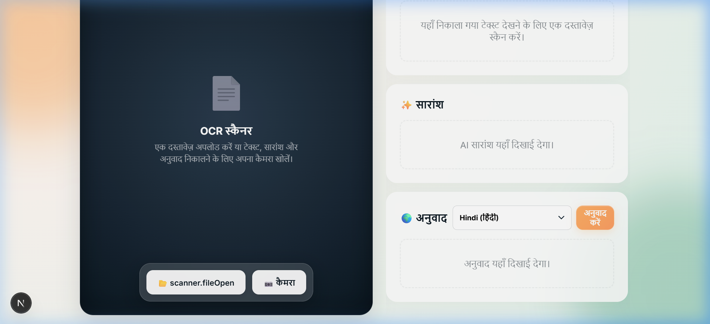
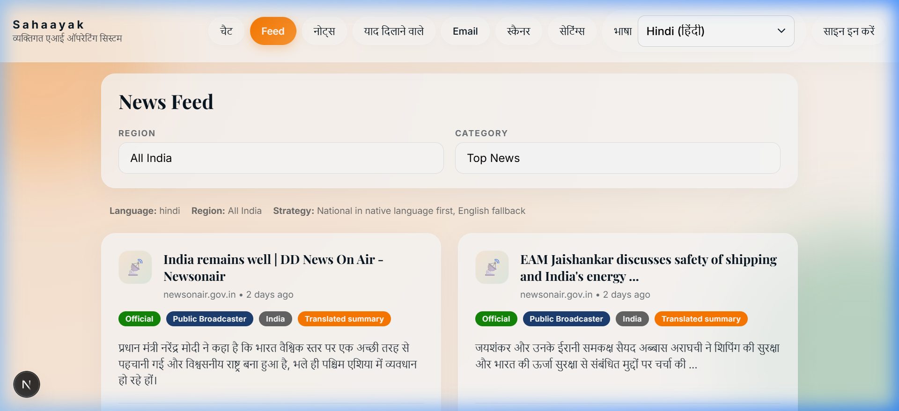
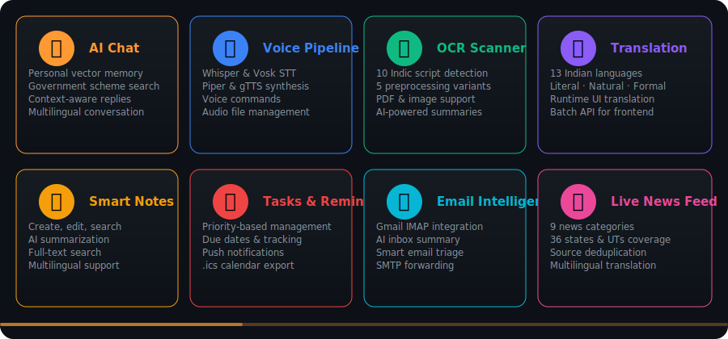
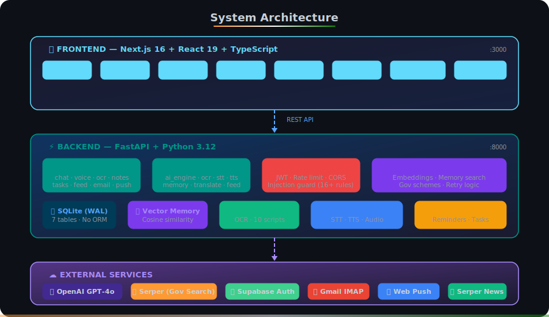

<div align="center">

<br/>

<!-- Logo -->
<a href="https://github.com/inbharatai/sahaayak-ai">

</a>

<h1>Sahaayak AI OS</h1>

<br/><br/>

<!-- Animated Typing SVG -->
<a href="https://github.com/inbharatai/sahaayak-ai">

</a>

<br/><br/>

<!-- Built with Claude Code -->
[](https://claude.ai/claude-code)

<br/>

<!-- Badge Row -->
[]()
[](https://github.com/inbharatai/sahaayak-ai/releases)
[]()
[](LICENSE)

<br/>

<!-- Tech badges (flat) -->


<br/>

[**Get Started**](#-quick-start) &nbsp;·&nbsp; [**Features**](#-features) &nbsp;·&nbsp; [**Architecture**](#%EF%B8%8F-architecture) &nbsp;·&nbsp; [**Tech Stack**](#%EF%B8%8F-tech-stack) &nbsp;·&nbsp; [**API Docs**](#-api-reference) &nbsp;·&nbsp; [**Contributing**](#-contributing)

</div>

<br/>

---

<br/>

## 🪄 What is Sahaayak?

**Sahaayak** (सहायक — *"helper"* in Hindi) is a multilingual personal AI operating system designed for **1.4 billion Indian users**. It combines AI chat, voice, document scanning, translation, notes, tasks, emails, and news into one seamless workspace — all in **13 Indian languages**.

<div align="center">

> *"Your AI, your language."*

</div>

Powered by GPT and Claude.

<br/>

### 📸 Premium User Interface

<div align="center">
  
  
</div>

<div align="center" style="margin-top: 2%;">
  
  
</div>

<br/>

### 🎬 Feature Demo Videos

<div align="center">

| Demo | Description |
|:-----|:------------|
| [Landing Page](docs/images/demo-landing.webp) | Hero section, features, and scroll-through |
| [AI Chat + TTS](docs/images/demo-chat.webp) | Government scheme query in Hindi + voice |
| [Document Scanner](docs/images/demo-scanner.webp) | OCR scanner with Hindi translations |
| [Notes & Reminders](docs/images/demo-notes-reminders.webp) | Note creation and task management |
| [Feed & Settings](docs/images/demo-feed-settings.webp) | Live news feed and system settings |
| [i18n Verification](docs/images/demo-i18n.webp) | Hindi translations across all pages |

</div>

<br/>

<br/>

---

<br/>

## ✨ Features

<div align="center">

<!-- Custom SVG Feature Cards -->


</div>

<br/>

<details>
<summary><b>📋 Full Feature List (click to expand)</b></summary>

<br/>

| Category | Capabilities |
|:---------|:-------------|
| 🤖 **AI Chat** | Conversational AI with personal vector memory, government scheme retrieval, context-aware multilingual replies |
| 🎙️ **Voice Pipeline** | Native Browser Microphone STT, Speech-to-text (OpenAI Whisper/Vosk), Text-to-speech (OpenAI tts-1-hd/Piper/gTTS) |
| 📷 **OCR Scanner** | Tesseract + RapidOCR with 10-script Indic detection, 5 preprocessing variants, PDF support, AI summary |
| 🌐 **Translation** | 13 Indian languages with quality modes (literal / natural / formal), batch UI translation |
| 📝 **Smart Notes** | Create, edit, search, Multilingual AI-Summarize notes with full-text search |
| ⏰ **Reminders** | Scheduled reminders with APScheduler, push notifications, .ics calendar export |
| ✅ **Task Manager** | Priorities, due dates, completion tracking, .ics export |
| 📧 **Email Intelligence** | Gmail IMAP, Multilingual AI-Powered inbox summarization, smart triage |
| 📰 **Live News Feed** | 9 categories, 36 states/UTs coverage, source deduplication, multilingual translation |
| 💬 **WhatsApp Share** | Contact prefill, native OS share sheet |
| 📄 **PDF Export** | Full Indic script support with Noto Sans fonts |
| 🔔 **Push Notifications** | VAPID web push for task & reminder alerts |
| 🔐 **Authentication** | Optional Supabase JWT — works without login in dev mode |
| 🛡️ **Security** | Rate limiting, prompt injection guard (16+ patterns), input validation, CORS, security headers |

</details>

<br/>

---

<br/>

## 📊 At a Glance

<div align="center">

<table>
<tr>
<td align="center"><h3>📦</h3><b>24+</b><br/><sub>API Endpoints</sub></td>
<td align="center"><h3>🌐</h3><b>13</b><br/><sub>Languages</sub></td>
<td align="center"><h3>🧩</h3><b>15</b><br/><sub>Services</sub></td>
<td align="center"><h3>📱</h3><b>8</b><br/><sub>App Pages</sub></td>
<td align="center"><h3>🛡️</h3><b>8</b><br/><sub>Security Layers</sub></td>
<td align="center"><h3>📡</h3><b>12</b><br/><sub>API Routers</sub></td>
</tr>
</table>

<br/>

🥇 **v1.0 Released** &nbsp;·&nbsp; 🇮🇳 **13 Indian Languages** &nbsp;·&nbsp; 🔒 **Security Audited** &nbsp;·&nbsp; 🧠 **Vector Memory** &nbsp;·&nbsp; 📷 **10-Script OCR** &nbsp;·&nbsp; 🎙️ **Full Voice Pipeline**

</div>

<br/>

---

<br/>

## 🏗️ Architecture

<div align="center">

<!-- Custom SVG Architecture Diagram -->


</div>

<br/>

**Key design decisions:**

| Decision | Reason |
|:---------|:-------|
| **No ORM** | Intentional raw SQLite for minimal dependencies and full control |
| **AI Singleton** | All AI calls go through `ai_engine.py` — routers never import AI clients directly |
| **Graceful Degradation** | Every AI feature returns a human-readable fallback when API keys are missing |
| **Webpack Mode** | `next dev --webpack` required (Turbopack has a known manifest bug with this app) |

<br/>

<details>
<summary><b>📁 Full Project Structure (click to expand)</b></summary>

```
sahaayak-ai/
│
├── 🔧 backend/
│   ├── main.py                     # FastAPI app + middleware + security headers
│   ├── requirements.txt            # Python dependencies (30+ packages)
│   ├── .env.example                # Environment template
│   └── app/
│       ├── core/
│       │   ├── config.py           # Pydantic settings (30+ env vars)
│       │   ├── database.py         # SQLite + WAL mode + 7 tables
│       │   ├── security.py         # JWT auth + production guard
│       │   ├── injection_guard.py  # 16+ prompt injection patterns
│       │   └── rate_limit.py       # SlowAPI throttling
│       ├── routers/                # 12 API endpoint modules
│       │   ├── chat.py             #   💬 AI conversation + memory
│       │   ├── voice.py            #   🎙️ STT / TTS / voice commands
│       │   ├── ocr.py              #   📷 Document scanning
│       │   ├── translation.py      #   🌐 Language translation (public)
│       │   ├── notes.py            #   📝 Note management
│       │   ├── reminders.py        #   ⏰ Reminder scheduling
│       │   ├── tasks.py            #   ✅ Task management
│       │   ├── email_inbox.py      #   📧 Gmail IMAP integration
│       │   ├── feed.py             #   📰 News aggregation
│       │   ├── documents.py        #   📄 File sharing via email
│       │   ├── push.py             #   🔔 Web push subscriptions
│       │   └── alerts.py           #   📊 Notification polling
│       └── services/               # 15 business logic modules
│
├── 🎨 frontend/
│   ├── package.json
│   ├── app/                        # Next.js pages
│   │   ├── page.tsx                #   🏠 Landing page
│   │   ├── chat/page.tsx           #   💬 AI chat interface
│   │   ├── notes/page.tsx          #   📝 Notes UI
│   │   ├── reminders/page.tsx      #   ⏰ Reminders UI
│   │   ├── scanner/page.tsx        #   📷 OCR scanner
│   │   ├── email/page.tsx          #   📧 Email inbox
│   │   ├── feed/page.tsx           #   📰 News feed
│   │   └── settings/page.tsx       #   ⚙️ Preferences
│   ├── components/                 # Reusable React components
│   └── lib/
│       ├── i18n.ts                 #   🌐 13-language dictionary (370+ keys)
│       ├── api.ts                  #   🔌 API client with retry
│       └── share.ts                #   📤 Share sheet utilities
│
├── setup.sh                        # 🍎 macOS/Linux one-command setup
├── setup.ps1                       # 🪟 Windows one-command setup
├── SECURITY.md                     # 🔒 Security policy
├── CHANGELOG.md                    # 📋 Version history
└── .github/                        # 📝 Issue & PR templates
```

</details>

<br/>

---

<br/>

## 🚀 Quick Start

> [!TIP]
> **Prerequisites:** Python 3.12+ · Node.js 18+ · Tesseract OCR *(optional, for scanning)*

### ⚡ One-Command Setup

<table>
<tr>
<td width="50%">

**🍎 macOS / 🐧 Linux**
```bash
git clone https://github.com/inbharatai/sahaayak-ai.git
cd sahaayak-ai
chmod +x setup.sh && ./setup.sh
```

</td>
<td width="50%">

**🪟 Windows (PowerShell)**
```powershell
git clone https://github.com/inbharatai/sahaayak-ai.git
cd sahaayak-ai
.\setup.ps1
```

</td>
</tr>
</table>

<details>
<summary><b>📋 Manual Setup (click to expand)</b></summary>

<br/>

```bash
# 1. Clone
git clone https://github.com/inbharatai/sahaayak-ai.git && cd sahaayak-ai

# 2. Backend
cd backend
python -m venv .venv && source .venv/bin/activate   # Windows: .venv\Scripts\activate
pip install -r requirements.txt
cp .env.example .env                                 # ← add your API keys

# 3. Frontend (new terminal)
cd frontend && npm install
```

</details>

### ▶️ Run

```bash
# Terminal 1 — Backend
cd backend && uvicorn main:app --reload --host 127.0.0.1 --port 8000

# Terminal 2 — Frontend
cd frontend && npm run dev
```

<div align="center">

| | URL | Description |
|---|---|---|
| 🌐 | [`http://localhost:3000`](http://localhost:3000) | **Application** |
| 📚 | [`http://127.0.0.1:8000/docs`](http://127.0.0.1:8000/docs) | **Swagger API Docs** |
| 📖 | [`http://127.0.0.1:8000/redoc`](http://127.0.0.1:8000/redoc) | **ReDoc API Docs** |

</div>

<br/>

---

<br/>

## 🛠️ Tech Stack

<div align="center">

### Frontend


### Backend


-003B57?style=for-the-badge&logo=sqlite&logoColor=white)


### AI & ML


-FF4444?style=for-the-badge)

</div>

<br/>

---

<br/>

## 🌐 Supported Languages

<div align="center">

<table>
<tr>
<td align="center"><b>Language</b></td>
<td align="center"><b>Code</b></td>
<td align="center"><b>Script</b></td>
<td>&nbsp;&nbsp;&nbsp;</td>
<td align="center"><b>Language</b></td>
<td align="center"><b>Code</b></td>
<td align="center"><b>Script</b></td>
</tr>
<tr><td>English</td><td><code>en</code></td><td>Latin</td><td></td><td>Hindi हिन्दी</td><td><code>hi</code></td><td>Devanagari</td></tr>
<tr><td>Bengali বাংলা</td><td><code>bn</code></td><td>Bengali</td><td></td><td>Tamil தமிழ்</td><td><code>ta</code></td><td>Tamil</td></tr>
<tr><td>Telugu తెలుగు</td><td><code>te</code></td><td>Telugu</td><td></td><td>Marathi मराठी</td><td><code>mr</code></td><td>Devanagari</td></tr>
<tr><td>Gujarati ગુજરાતી</td><td><code>gu</code></td><td>Gujarati</td><td></td><td>Kannada ಕನ್ನಡ</td><td><code>kn</code></td><td>Kannada</td></tr>
<tr><td>Malayalam മലയാളം</td><td><code>ml</code></td><td>Malayalam</td><td></td><td>Punjabi ਪੰਜਾਬੀ</td><td><code>pa</code></td><td>Gurmukhi</td></tr>
<tr><td>Assamese অসমীয়া</td><td><code>as</code></td><td>Assamese</td><td></td><td>Odia ଓଡ଼ିଆ</td><td><code>or</code></td><td>Odia</td></tr>
<tr><td>Urdu اردو</td><td><code>ur</code></td><td>Nastaliq</td><td></td><td></td><td></td><td></td></tr>
</table>

<br/>

**Translation Quality Modes:** &nbsp; `Literal` &nbsp;·&nbsp; `Natural` &nbsp;·&nbsp; `Formal`

</div>

<br/>

---

<br/>

## 📖 API Reference

> [!NOTE]
> Full interactive API docs at [`/docs`](http://127.0.0.1:8000/docs) (Swagger UI) when running locally.

<details>
<summary><b>🔌 12 API Domains · 24+ Endpoints (click to expand)</b></summary>

<br/>

| | Domain | Endpoint | Description |
|:--|:-------|:---------|:------------|
| 🤖 | **Chat** | `POST /chat/` | AI conversation with vector memory & gov scheme search |
| 🎙️ | **Voice** | `POST /voice/stt` | Speech-to-text (Whisper / Vosk) |
| | | `POST /voice/tts` | Text-to-speech (Piper / gTTS) |
| | | `POST /voice/command` | Voice command processing |
| 📷 | **OCR** | `POST /ocr/scan` | Image/PDF → text + AI summary |
| 🌐 | **Translation** | `POST /translation/translate` | Translate text *(public — no auth)* |
| | | `POST /translation/batch` | Batch translate UI dictionary |
| 📝 | **Notes** | `GET/POST/PUT/DELETE /notes/` | Full CRUD + AI summarization |
| ⏰ | **Reminders** | `GET/POST/PUT/DELETE /reminders/` | CRUD + `.ics` calendar export |
| ✅ | **Tasks** | `GET/POST/PUT/DELETE /tasks/` | CRUD + `.ics` calendar export |
| 📧 | **Email** | `GET /email/inbox` | Fetch Gmail inbox via IMAP |
| | | `GET /email/summary` | AI-powered inbox summary |
| 📰 | **Feed** | `GET /feed/` | State-wise categorized Indian news |
| 🔔 | **Push** | `POST /push/subscribe` | Register web push endpoint |
| 📊 | **Alerts** | `GET /alerts/pending` | Poll pending notifications |

> **Auth:** Endpoints require Supabase JWT when `SUPABASE_JWT_SECRET` is set. In dev mode (no secret), all endpoints are open.

</details>

<br/>

---

<br/>

## 🔒 Security

<div align="center">

| | Layer | Details |
|:--:|:------|:--------|
| 🛡️ | **Prompt Injection Guard** | 16+ regex patterns · structural heuristics · Unicode confusable normalization |
| 🔐 | **JWT Authentication** | Supabase JWT · production auth guard · dev bypass when unconfigured |
| ⚡ | **Rate Limiting** | SlowAPI per-endpoint throttling · 60 req/min default |
| 🧱 | **Security Headers** | `X-Frame-Options: DENY` · `nosniff` · HSTS · `Referrer-Policy` |
| 📂 | **Path Traversal Protection** | Filename-only validation · directory separator rejection |
| 💉 | **SQL Safety** | Parameterized queries · identifier validation for dynamic table names |
| 🌐 | **CORS** | Strict origin allowlist · production domain lock |
| 🏛️ | **Gov URL Validation** | Proper `.gov.in` / `.nic.in` domain suffix matching |

</div>

> [!IMPORTANT]
> See [**SECURITY.md**](SECURITY.md) for the full security policy and vulnerability disclosure process.

<br/>

---

<br/>

## ⚙️ Environment Variables

<details>
<summary><b>🔑 Configuration Reference (click to expand)</b></summary>

<br/>

| Variable | Required | Default | Description |
|:---------|:--------:|:--------|:------------|
| `OPENAI_API_KEY` | **Yes** | — | API key for all AI features |
| `SERPER_API_KEY` | No | — | Google Serper for government scheme search |
| `SUPABASE_URL` | No | — | Supabase project URL (for auth) |
| `SUPABASE_JWT_SECRET` | No | — | JWT secret — auth disabled if blank |
| `SMTP_USER` | No | — | Gmail address for email features |
| `SMTP_PASSWORD` | No | — | Gmail app password |
| `VAPID_PRIVATE_KEY` | No | *auto* | Auto-generated if blank |
| `WHISPER_MODEL_SIZE` | No | `small` | Whisper model size |
| `TESSERACT_CMD` | No | *system* | Path to Tesseract OCR binary |
| `ENVIRONMENT` | No | `development` | Set to `production` for full security |
| `CORS_ORIGINS` | No | `localhost` | Comma-separated allowed origins |

</details>

<br/>

---

<br/>

## 🤝 Contributing

<div align="center">

**We love contributions!** Whether it's a bug fix, new feature, or translation improvement.

</div>

<br/>

1. 🍴 **Fork** the repository
2. 🌿 **Branch** — `git checkout -b feature/amazing-feature`
3. 💾 **Commit** — `git commit -m 'Add amazing feature'`
4. 📤 **Push** — `git push origin feature/amazing-feature`
5. 🎯 **Open** a Pull Request

> [!NOTE]
> **Project conventions:** No ORM (raw SQLite) · Never hardcode English strings (use `t()`) · All AI calls through `ai_engine.py` · Injection guard on every chat route · `next dev --webpack`

See the [**PR template**](.github/PULL_REQUEST_TEMPLATE.md) for the full checklist.

<br/>

---

<br/>

## 📄 License

This project is licensed under the **MIT License** — see the [LICENSE](LICENSE) file for details.

<br/>

---

<div align="center">

<br/>


<br/>

**Built with ❤️ for Bharat by [InBharat AI](https://github.com/inbharatai)**

*Empowering 1.4 billion people with AI in their own language*

<br/>

[](https://github.com/inbharatai/sahaayak-ai)

<br/>


<sub>If Sahaayak helped you, give it a ⭐ — it means the world to us!</sub>

<br/><br/>

<a href="https://claude.ai/claude-code">

</a>

<sub>🤖 Developed with [Claude Code](https://claude.ai/claude-code) by Anthropic</sub>

</div>

